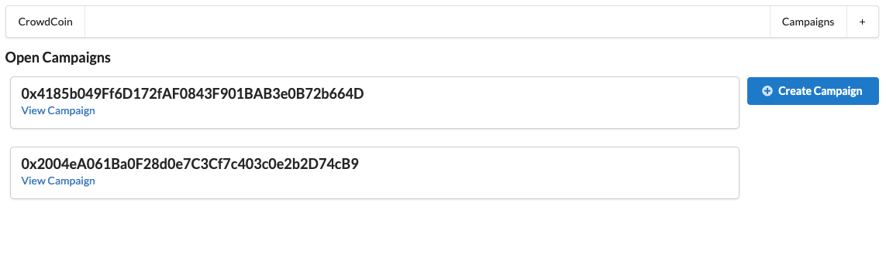
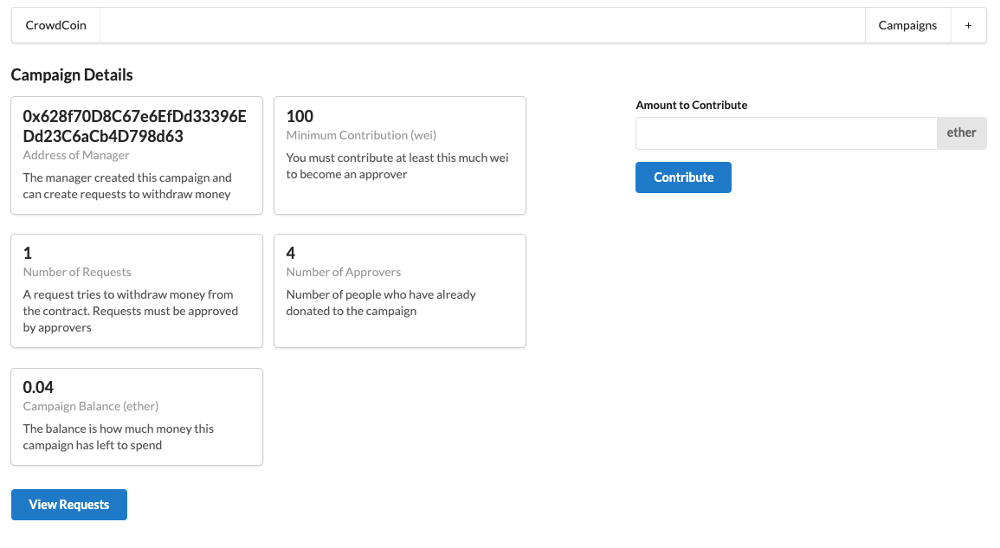
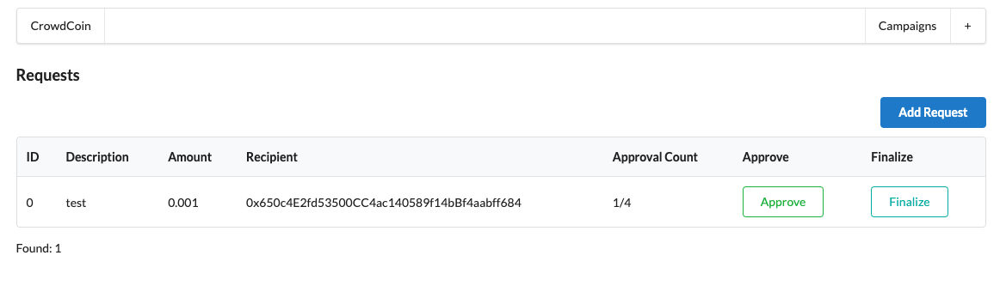

A demo crowdfunding application using Ethereum. Note: currently it's necessary to have [Metamask](https://metamask.io/) downloaded to connect your Ethereum wallet on the Rinkeby network.

## [Demo](https://eth-crowdfunding-os7opv7kx-jcolla-holla.vercel.app/)

## Features
* A user (Campaign Manager) starts a crowdfunding campaign
* Other users (Supporters) can contribute Ethereum to support the campaign
* Campaign Manager user creates Requests for transparent funding spending requests
* Supporters approve or reject Requests
* Once approved, Requests transfer Ethereum to the party in question (think like a vendor for some service needed to purchase for the campaign to succeed)

## Technologies Used:
* Next.js v12.0.7
* React v17.0.2
* web3.js v1.6.1
* semantic-ui-react v2.4.1
* solc v0.4.17
* ganache-cli v6.12.2
* @truffle/hdwallet-provider v1.7.0

## Campaigns Page (home page)

## Campaign Details Page

## Campaign Requests Page

